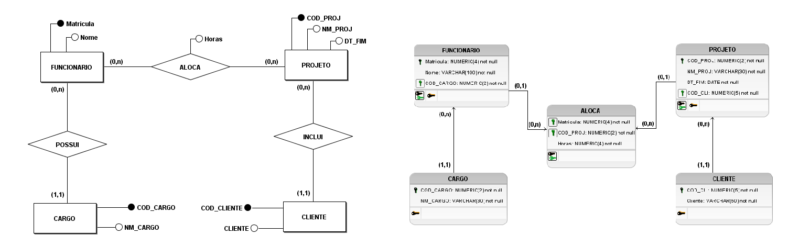

  <h1 align="center" href="#clipboard-about"> Banco de Dados SQL </h1>

  ## :clipboard: Learned: 
  At class with the DBA teacher [José Ricardo Maçaneiro](https://www.linkedin.com/in/jos%C3%A9-ricardo-ma%C3%A7aneiro-54a8677/), we learned how the relational model works. It's the start before create the tables, primary keys... on the code. here are a example of relational model:
 

    
     

  After the concept and the models, we start coding in MySql database, and I learned the it demands a very logic thoughts. The difficult I had was modified a database that is already created, especially when it's has the data. here are an example of a code, with DML and DDL and in the sequel a DQL example we had to develop:

  
   

##  

  
   

 